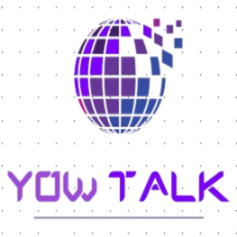

# Yow Talk 💬

Une application de messagerie mobile moderne construite avec React Native et Expo, offrant une communication en temps réel avec une interface utilisateur intuitive.



## 📱 Aperçu

Yow Talk est une application de chat complète permettant aux utilisateurs de communiquer instantanément avec leurs contacts. L'application propose une expérience utilisateur fluide avec des fonctionnalités modernes telles que la messagerie en temps réel, le partage de fichiers, et une interface adaptative.

### ✨ Fonctionnalités principales

- 🔐 **Authentification sécurisée** - Inscription et connexion utilisateur
- 💬 **Messagerie en temps réel** - Chat instantané avec Socket.io
- 👥 **Gestion des contacts** - Ajout et organisation des contacts
- 📎 **Partage de fichiers** - Envoi de documents et médias
- 😊 **Support des émojis** - Picker d'émojis intégré
- 🔍 **Recherche avancée** - Recherche dans les conversations et contacts
- 🌙 **Mode sombre** - Interface adaptable selon les préférences
- 📱 **Design responsive** - Optimisé pour iOS et Android

## 🛠️ Technologies utilisées

### Frontend
- **React Native** `0.79.4` - Framework mobile cross-platform
- **Expo** `53.0.0` - Plateforme de développement
- **TypeScript** - Typage statique pour JavaScript
- **Expo Router** - Navigation native et routing
- **React Navigation** - Navigation entre écrans

### Communication & État
- **Socket.io Client** - Communication temps réel
- **Axios** - Client HTTP pour les API REST
- **AsyncStorage** - Stockage local persistant

### Interface utilisateur
- **React Native Vector Icons** - Icônes vectorielles
- **Material Top Tabs** - Navigation par onglets
- **React Native Gesture Handler** - Gestion des gestes
- **Date-fns** - Manipulation des dates

## 🚀 Installation et configuration

### Prérequis

- Node.js (v16 ou supérieur)
- npm ou yarn
- Expo CLI (`npm install -g @expo/cli`)
- Simulateur iOS/Android ou appareil physique

### Installation

1. **Cloner le repository**
```bash
git clone https://github.com/PIO-VIA/Snapppy.git
cd yow-talk
```

2. **Installer les dépendances**
```bash
npm install
```

3. **Configuration de l'environnement**

Vérifiez les constantes dans `lib/constants.ts` :
```typescript
export const API_URL = "http://88.198.150.195:8613";
export const API_SOCKET_URL = "http://88.198.150.195:8614";
export const PROJECT_ID = "81997082-7e88-464a-9af1-b790fdd454f8";
```

4. **Lancer l'application**
```bash
# Démarrage du serveur de développement
npm start

# Pour Android
npm run android

# Pour iOS
npm run ios
```

## 📁 Structure du projet

```
yow-talk/
├── app/                          # Écrans de l'application
│   ├── login.tsx                 # Écran de connexion
│   ├── signup.tsx                # Écran d'inscription
│   ├── home.tsx                  # Écran d'accueil avec navigation
│   ├── chat.tsx                  # Liste des conversations
│   ├── ChatItems.tsx             # Interface de chat
│   ├── status.tsx                # Gestion des contacts
│   └── settings.tsx              # Paramètres de l'application
├── components/                   # Composants réutilisables
│   ├── ThemeText.tsx             # Composant texte thématisé
│   ├── ThemeTextInput.tsx        # Input thématisé
│   ├── EmojiPicker.tsx           # Sélecteur d'émojis
│   └── Menu.tsx                  # Menu de navigation
├── services/                     # Services et logique métier
│   ├── authentication-service.ts # Gestion de l'authentification
│   ├── chat-service.ts           # Services de messagerie
│   └── contact-service.ts        # Gestion des contacts
├── lib/                          # Bibliothèques et utilitaires
│   ├── SnappyHTTPClient.ts       # Client HTTP personnalisé
│   ├── SnappySocketClient.ts     # Client WebSocket
│   ├── models/                   # Modèles TypeScript
│   └── constants.ts              # Configuration globale
├── contexts/                     # Contextes React
│   └── ContactContext.tsx        # Contexte de gestion des contacts
└── assets/                       # Ressources statiques
    └── images/                   # Images et icônes
```

## 🔌 API et Backend

L'application communique avec un backend REST et utilise WebSocket pour la messagerie temps réel.

### Points d'API principaux

- **Authentication**: `/auth/user`
- **Utilisateurs**: `/users/*`
- **Chat**: `/chat/*`
- **Contacts**: `/users/add-contact`

### Modèles de données

Les principaux modèles incluent :
- `User` - Informations utilisateur
- `Message` - Structure des messages
- `ChatResource` - Ressources de conversation
- `ContactDto` - Données de contact

## 🔧 Configuration avancée

### Variables d'environnement

Modifiez `lib/constants.ts` pour votre environnement :

```typescript
// URLs de développement
const DEVELOPMENT_API_URL = "http://localhost:8613";
const DEVELOPMENT_SOCKET_URL = "http://localhost:8614";

// URLs de production
const PRODUCTION_API_URL = "https://your-api.com";
const PRODUCTION_SOCKET_URL = "https://your-socket.com";
```

### Build pour production

```bash
# Build Android (APK)
eas build --platform android --profile preview

# Build iOS
eas build --platform ios --profile preview

# Build pour production
eas build --platform all --profile production
```

## 🧪 Tests et développement

```bash
# Lancer les tests
npm test

# Linter
npm run lint

# Reset du projet
npm run reset-project
```

## 📱 Fonctionnalités détaillées

### Authentification
- Inscription avec validation email
- Connexion sécurisée
- Gestion des sessions
- Déconnexion

### Messagerie
- Chat en temps réel via Socket.io
- Historique des messages persistant
- Indicateurs de statut (envoyé, reçu, lu)
- Support des pièces jointes

### Contacts
- Ajout de contacts par email/nom
- Recherche et filtrage
- Statut en ligne/hors ligne
- Gestion des favoris

### Interface
- Design Material Design
- Animations fluides
- Navigation intuitive
- Support multi-langue (prêt)

## 🤝 Contribution

1. Fork le projet
2. Créer une branche feature (`git checkout -b feature/nouvelle-fonctionnalite`)
3. Commit les changements (`git commit -m 'Ajout nouvelle fonctionnalité'`)
4. Push vers la branche (`git push origin feature/nouvelle-fonctionnalite`)
5. Ouvrir une Pull Request

## 📄 Licence

Ce projet est sous licence MIT. Voir le fichier `LICENSE` pour plus de détails.


## 📞 Support

Pour toute question ou problème :
- 📧 Email : piodjiele@gmail.com
- 📚 Documentation : (https://snappy-sdk-documentation.vercel.app/)

## 🔄 Changelog

### Version 1.0.0
- ✅ Authentification utilisateur
- ✅ Messagerie temps réel
- ✅ Gestion des contacts
- ✅ Interface responsive
- ✅ Support des émojis

---

**Yow Talk** - Communiquez sans limites 🚀